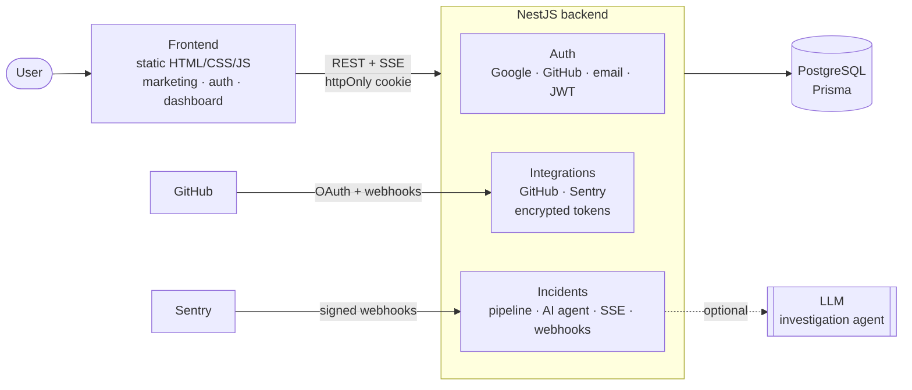
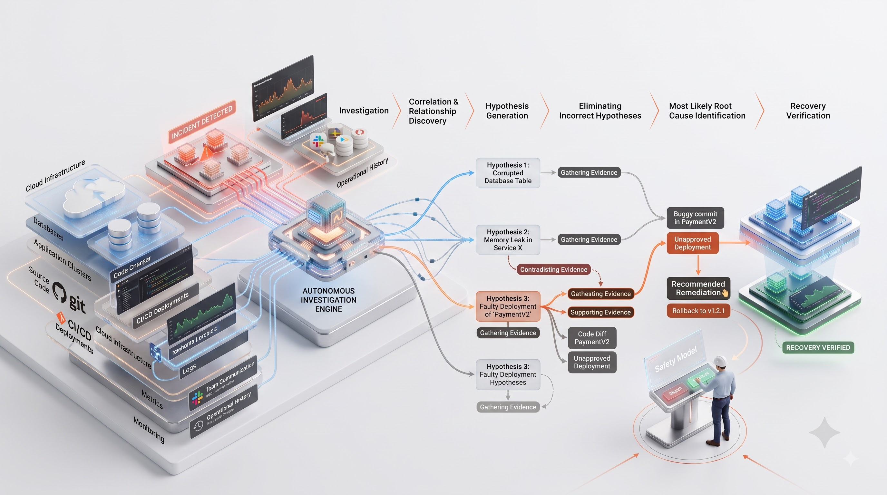
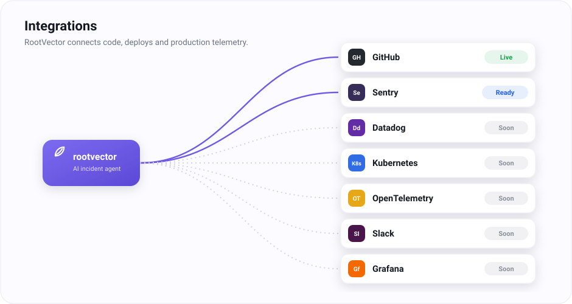
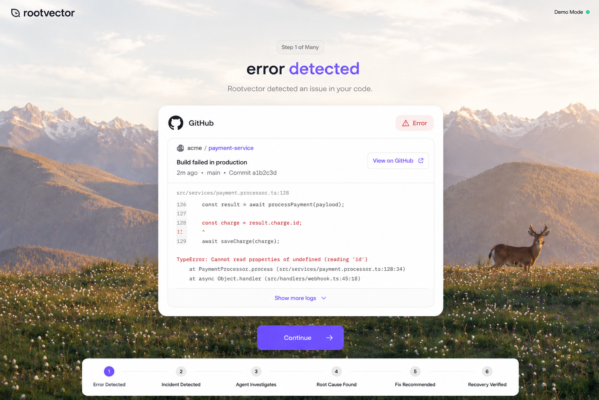
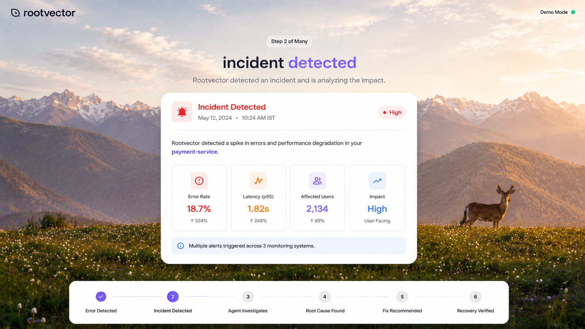
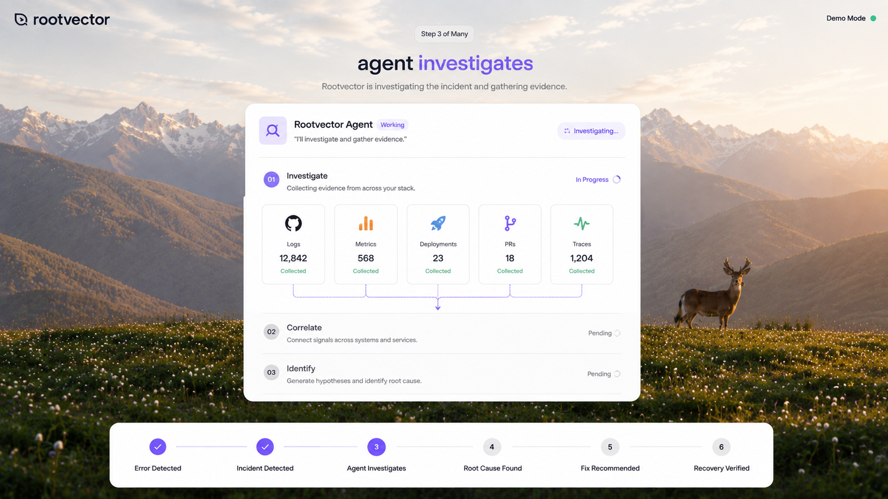
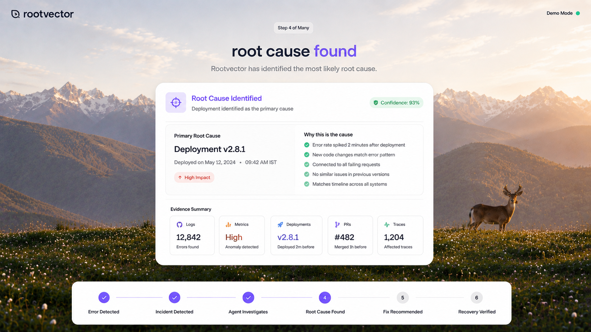
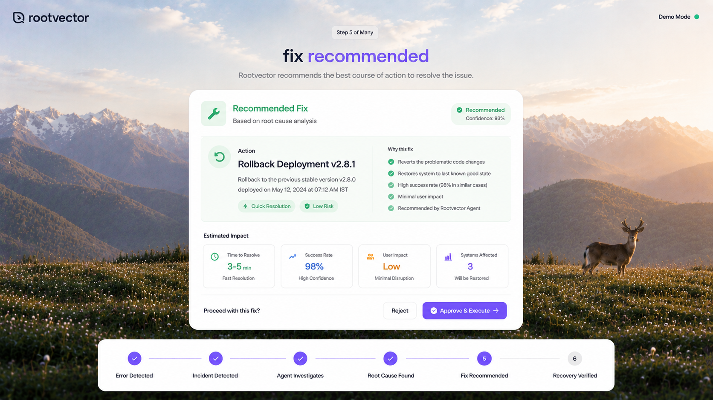
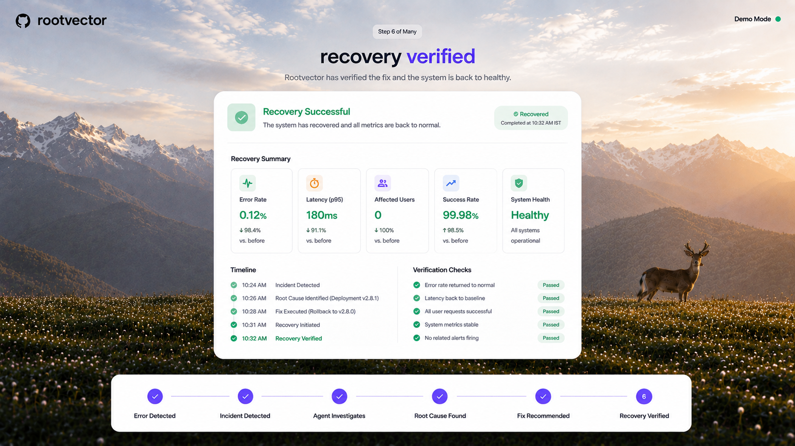

# RootVector

**An AI production-incident investigation agent.** RootVector connects to your engineering stack, detects production incidents from real monitoring signals, and runs an autonomous investigation — correlating deployments, pull requests, errors and traces — to surface a **root cause with evidence and a confidence score**, then recommends a fix that a human approves before anything is executed.

> Find the cause. Verify the evidence. Fix the system.

---

## The problem

When production breaks, one engineer drops everything and spends **30–60 minutes** manually stitching together logs, deployments, GitHub, Slack and past incidents to find the cause. Meanwhile customers are impacted, the on-call is overloaded, and the roadmap slips. The real cost of an incident isn't just downtime — it's the context-switching and the manual detective work, every single time.

## The solution

**RootVector is an autonomous incident-investigation agent.** It connects to your engineering stack, detects incidents from real monitoring signals, and runs the entire investigation itself — correlating deployments, pull requests, errors and traces — then returns a **root cause with evidence and a confidence score** plus a recommended fix. A human stays in the loop: nothing is executed until a person approves. After remediation, RootVector **verifies recovery** against the metrics.

## Architecture



**Layers**

- **Frontend** — static HTML/CSS/JS (no build): marketing site, auth pages, single-page dashboard. Talks to the API over REST + Server-Sent Events with an httpOnly session cookie.
- **Backend (NestJS)** — `auth` (Google/GitHub/email + JWT), `integrations` (provider OAuth, AES-256-GCM token storage, signature-verified webhooks), `incidents` (the pipeline, the AI investigation agent, SSE streaming).
- **Data** — PostgreSQL via Prisma: users, integrations, incidents, investigation events, activity, webhook deliveries.
- **AI agent** — gathers real evidence and produces hypotheses, a root cause and a recommendation; uses an LLM when configured, and a grounded correlation engine otherwise.

**The platform — from signals to autonomous investigation to a human-approved fix:**



## Integrations

RootVector uses a provider-based integration framework — connect a tool and it starts feeding real signals into the incident pipeline. **GitHub** is live, **Sentry** is signature-verified and ready, and the rest are scaffolded.



---

## Screenshots

A walkthrough of a single incident, from detection to verified recovery:

| Error detected | Incident detected | Agent investigates |
|---|---|---|
|  |  |  |

| Root cause found | Fix recommended | Recovery verified |
|---|---|---|
|  |  |  |

---

## What it does

```
LOGIN → OVERVIEW → CONNECT STACK (GitHub · Sentry)
     → real events → INCIDENT DETECTED
     → AI INVESTIGATION (evidence · correlation · hypotheses · confidence)
     → ROOT CAUSE + WHY → RECOMMENDED FIX
     → HUMAN APPROVAL → REMEDIATION → RECOVERY VERIFIED
```

- **Real authentication** — email/password, **Google** (ID/access token verified server-side) and **GitHub** (OAuth, secret stays on the server). Sessions are a signed JWT in an **httpOnly cookie** — no token is ever exposed to the browser.
- **Real profile everywhere** — the dashboard greets the authenticated user by name and shows their real provider avatar (a clean blank avatar when the provider gives none — never a fake one).
- **GitHub integration** — connect your account and see your real repositories and recent activity (commits, PRs, pushes). Tokens are stored **AES‑256‑GCM encrypted** at rest.
- **Incident pipeline** — a real, persisted `incident → investigation → remediation → verification` flow. A monitoring error (Sentry) opens an incident automatically; a built-in **Demo Mode** runs the *same* pipeline for demonstrations.
- **AI investigation agent** — gathers real evidence, produces competing **hypotheses with confidence**, a root cause grounded in the evidence, and a reversible remediation. Uses an LLM when configured, and a grounded correlation engine otherwise.
- **Live investigation UI** — the agent's steps stream to the browser over **Server-Sent Events**; hypotheses, root cause and recommendation render as they arrive.
- **Human-in-the-loop** — the AI investigates and recommends, but a person must **Approve & Execute** before any remediation runs. Then recovery is verified against the metrics.
- **Integrations framework** — GitHub live; Sentry (webhook, signature-verified) ready; Datadog, Kubernetes, OpenTelemetry, Slack and Grafana scaffolded.

---

## Tech stack

**Frontend** — self-contained HTML/CSS/JS (no build step): a marketing site, auth pages, and a single‑page dashboard. Served statically.

**Backend** — NestJS (TypeScript) · Prisma · PostgreSQL · JWT (httpOnly cookie) · Server-Sent Events · AES‑256‑GCM for provider tokens · optional LLM for the investigation agent.

---

## Getting started

### 1. Backend (`server/`)

```bash
cd server
cp .env.example .env         # fill in JWT_SECRET, GitHub OAuth, etc.
docker compose up -d         # Postgres on :5433  (or: node pg-dev.js  — embedded Postgres, no Docker)
npm install
npx prisma generate
npx prisma migrate dev --name init
npm run start:dev            # http://localhost:4000/api
```

Fill in `server/.env`:
- `JWT_SECRET` — a long random string (`openssl rand -hex 32`).
- `GITHUB_CLIENT_ID` / `GITHUB_CLIENT_SECRET` — a GitHub OAuth App (callback `http://localhost:4000/api/auth/github/callback`).
- `GOOGLE_CLIENT_ID` — a Google OAuth Web client (origin `http://localhost:4178`).
- `INTEGRATIONS_ENCRYPTION_KEY` — 32 bytes hex (`openssl rand -hex 32`).
- *(optional)* `GEMINI_API_KEY` (+ optional `LLM_MODEL`, default `gemini-1.5-flash`) to enable LLM-driven investigation via Google Gemini. Get a free key at https://aistudio.google.com/apikey.

### 2. Frontend (repo root)

```bash
python -m http.server 4178
```

Open **http://localhost:4178/login.html**, sign in, and you're on the dashboard.

---

## Project structure

```
rootvector/
├─ index.html            # marketing site
├─ login.html            # sign in (Google · GitHub · email)
├─ signup.html           # create account
├─ app.html              # dashboard (SPA: overview, investigations, services,
│                        #   repositories, integrations, settings)
├─ assets/               # all images
└─ server/               # NestJS backend
   ├─ prisma/schema.prisma
   └─ src/
      ├─ auth/           # email/Google/GitHub auth, JWT guard
      ├─ users/          # /api/me
      ├─ integrations/   # GitHub connect + repos + activity (encrypted tokens)
      └─ incidents/      # incident pipeline, investigation agent, SSE, webhooks
```

---

## Security

- OAuth **secrets and access tokens never reach the frontend** — the browser only holds the httpOnly session cookie.
- Provider tokens are **encrypted at rest** (AES‑256‑GCM).
- Inbound webhooks are **HMAC signature-verified**.
- Destructive remediation requires **explicit human approval**.
- `.env` files are git-ignored; never commit real secrets.

---

## License

MIT

---

## Project status

> 🚧 &nbsp;**This project is currently in progress and not fully completed.**
>
> **Working:** real authentication (Google · GitHub · email), the authenticated profile, GitHub integration (repositories + live activity), the incident pipeline, the AI investigation agent, the live investigation UI (SSE), human approval, remediation and recovery verification.
>
> **Still to do:** full **Sentry** wiring, and the **Kubernetes**, **OpenTelemetry**, **Slack** and **Grafana** integrations (currently scaffolded / *Coming soon*), plus real-time GitHub webhooks. More to come.
